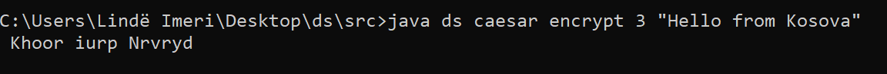
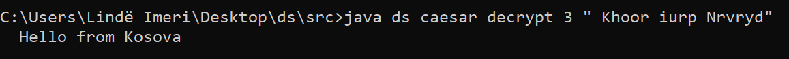
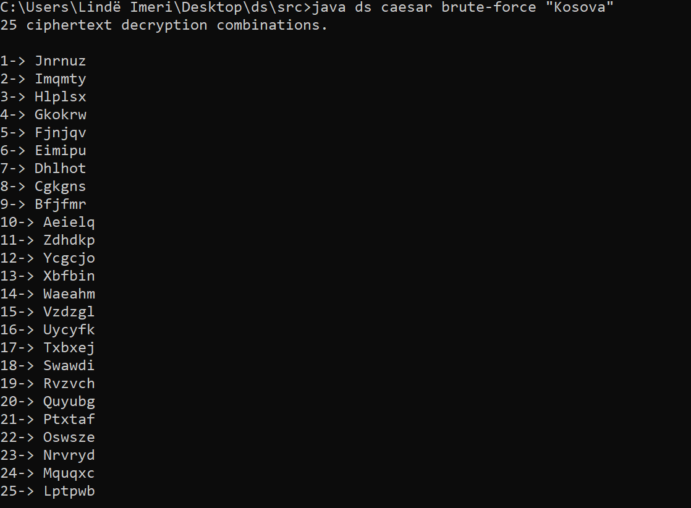
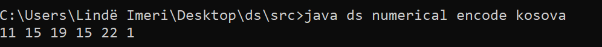
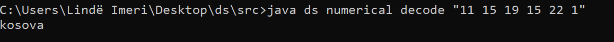
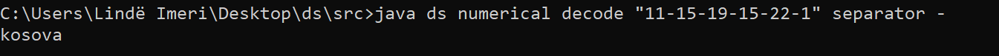
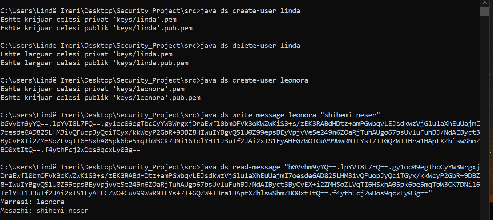
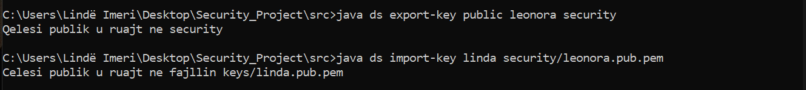

# Security_Project

This project offers the ability to encrypt and decrypt data through three commands:
1. Caesar Command
2. Permutation Command
3. Numerical Command

4. Create-user
5. Delete-user
6. Import-key
7. Export-key

8. Write-message
9. Read-message

# Description of commands

1. Caesar Command

      This command moves each plaintext(original text) letter to several positions in the alphabet

2. Permutation Command 

      This command transforms plaintext to block level by moving characters according to a permutation.
      Permutation represents the displacement positions within the block. 
      Unfulfilled blocks of character character, e.g. with "x" or "w".
 
3. Numerical Command

      With this command each letter is replaced with its alphabetical position. 
      Thus letter "a" is encoded subdomain1, letter "b" subdomain2,    etc.

4. Create-user

      Creates a public / private RSA pair with the names <name> .pem and <name> .pub.pem within the keys directory.
      
5. Delete-user      
      
      Removes all existing user keys.
      
6. Import-key

      Exports the user's public or private key from the key directory.
      
7. Export-key

      Imports the user's public or private key from the given path and places it in the key directory.
      
8. Write-message

      Writes an encrypted message dedicated to a user.
      
9. Read-message
      
      Decrypts and displays the encrypted message in the console.

# Instructions for using the program

1. Choose one of the commands provided above

2. Choose encryption or decryption

3. Print data (Depending on which command you choose, data is required)

4. If you need more information you can use the help command 

5. Be sure to type in the correct arguments for the desired results

6. Down below you have some photos of executing commands -HAVE A LOOK

 
 # Results of program execution
 
 Caesar Encrypt
 
  
 
 Caesar Decrypt
 
  
 
 Caesar Brute-Force
 
  
  
  
  
  Permutation Encrypt
  
  
  
  Permutation Decrypt
  
  
 
 
 
 Numerical Encrypt
 
 
 
 Numerical Decrypt
 
  
  
  Numerical Separator
  
   
   
   
   
  RSA algoritem 
   
Create-user, delete-user, write-message, read-message

import-key and export-key

