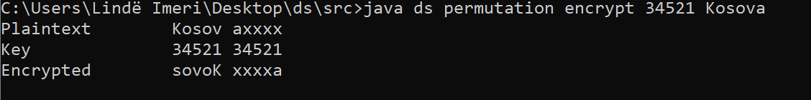

# Security_Project

This application offers several commands ranging from encryption and decryption through
-Ceasar Command
-Permutation Command and
-Numerical Command

Continuing with more advanced commands in the field of security like :

-Creating users and generating the public and private key pair of the RSA algorithm
-Saving user data in databases safely by storing hash algorithms and salting
-Management of passwords and authentication via digital signatures
-Delete user keys and remove all its data from the database safely without compromising other data
-Export and import keys in various directory
-User / password testing, issuance of a token (JWT) signed through the user's private key and for proof of signature the user's public key
-Encrypt and decrypt messages securely using private and public key

# Description of commands

1. Caesar Command

      This command moves each plaintext(original text) letter to several positions in the alphabet

2. Permutation Command 

      This command transforms plaintext to block level by moving characters according to a permutation.
      Permutation represents the displacement positions within the block. 
      Unfulfilled blocks of character character, e.g. with "x" or "w".
 
3. Numerical Command

      With this command each letter is replaced with its alphabetical position. 
      Thus letter "a" is encoded subdomain1, letter "b" subdomain2,    etc.

4. Create-user

      Creates a public / private RSA pair with the names <name> .pem and <name> .pub.pem within the keys directory.
      Also this command create user in database with hashed and salted data.
      
5. Delete-user      
      
      Removes all existing user keys and also deletes user data from database.
      
6. Import-key

      Exports the user's public or private key from the key directory.
      
7. Export-key

      Imports the user's public or private key from the given path and places it in the key directory.
      
8. Write-message

      Writes an encrypted message dedicated to a user, we used DES alorithm to encrypt the message , also there is another option to encrypt message with token (if token generated from login command is valid) .
      
9. Read-message
      
      Decrypts and displays the encrypted message in the console . If the sender / signature part of the message appears,
then the verification of that signature will be attempted using the sender's public key

# Instructions for using the program
    We have done some screnshot on how you can use this app 
 
 
 Caesar Encrypt
 
  
 
 Caesar Decrypt
 
  
 
 Caesar Brute-Force
 
  
  
  
  
  Permutation Encrypt
  
  
  
  Permutation Decrypt
  
  
 
 
 
 Numerical Encrypt
 
 
 
 Numerical Decrypt
 
  
  
  Numerical Separator
  
   
   
   
   
  RSA algorithm
   Create-user command execution
   
   
   Delete-user command execution
     
   Login command execution
     
   Status command execution
      
     Write and Read Message
        
        
     //Last Version
Create-user, delete-user, write-message, read-message

import-key and export-key

